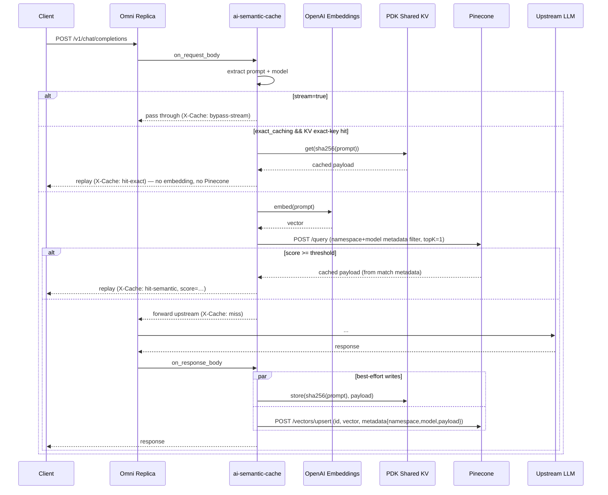

# AI Semantic Cache — Architecture

**Status:** Draft (pending implementation)
**Date:** 2026-05-21
**Policy family:** `ai-semantic-cache`
**MVP variant:** `ai-semantic-cache-policy-openai-pinecone`

## 1. Purpose & Positioning

Cache LLM responses keyed by **semantic similarity of the prompt** rather than exact-string match. On a hit, the gateway returns a cached completion without calling the upstream LLM, cutting token cost and latency. On a miss, it forwards upstream, captures the response, and writes `(embedding, response)` back to the vector store under a configured namespace.

**Competitive reference.** Kong AI Semantic Cache. We mirror its config surface (`namespace`, `similarity_threshold`, `ttl`, `exact_caching`) and add one safer default Kong lacks: the resolved `model` field is automatically folded into the cache key so a single route serving multiple models cannot return a `gpt-4o` response to a `gpt-3.5` prompt.

**Embedder coverage in MVP.** The `OpenAICompatibleEmbedder` targets any endpoint that speaks the OpenAI `POST /v1/embeddings` shape — so a single MVP variant binary covers, at a minimum:
- **Hosted:** OpenAI, Azure OpenAI (via `base_url` override + `api-key` auth header), Together AI, Fireworks AI, Anyscale, DeepInfra, Groq.
- **Self-hosted:** vLLM, Hugging Face TEI (Text Embeddings Inference), Ollama, LocalAI — plus any custom model server exposing the OpenAI shape.

This matches Kong's "any OpenAI-compatible endpoint" coverage in one binary, while still keeping the `(embedder, vector-store)` per-pair-binary discipline — because the variant is named after the *protocol* (`openai`), not a single hosted provider.

**Storage architecture in MVP.** Two layers, intentionally split:
- **Exact-cache fast path** (SHA-256 of canonicalized prompt → cached response): backed by **PDK's platform shared key-value store** via `pdk::data_storage::DataStorageBuilder.remote(...)`. No customer-managed infrastructure, no extra secret references. TTL handled by the platform; CAS available for future single-flight protection. The KV is part of the Omni Gateway Replica's runtime — it isn't a Redis URL the operator configures.
- **Semantic similarity lookup** (prompt embedding → top-k cached responses): backed by **Pinecone serverless** via its native HTTPS REST API. PDK's `HttpClient` talks to Pinecone directly — no Webdis sidecar, no protocol translator.

This split means *most cache hits cost zero external calls*: a byte-identical prompt is served from the platform KV with no embedding call and no Pinecone call. Only paraphrased prompts hit Pinecone.

**Non-goals (MVP).**
- Streaming replay (we bypass when `stream=true`).
- HuggingFace embedder.
- Qdrant / Azure AI Search backends — deferred to v2 as alternative premium variants.
- Single-flight / cache stampede protection.
- Write-through invalidation API.
- Adaptive thresholds.
- Embedding cache (caching the embedding itself, separate from the response cache).

## 2. Naming Convention

The policy adopts a new `ai-*` prefix, distinct from the repo's two existing prefixes:

| Prefix | Meaning | Examples |
|---|---|---|
| `semantic-*` | Technique-named (semantic similarity used internally) | `semantic-prompt-guard-*`, `semantic-routing-*` |
| `llm-*` | Workload-named (LLM traffic specific) | `llm-token-rate-limit-policy`, `llm-pii-detection-policy`, `llm-proxy-core-policy` |
| `ai-*` (new) | AI-workload, going-forward convention | `ai-semantic-cache-*` |

Going forward, new AI-workload policies SHOULD use the `ai-*` prefix. The Cargo crate names use underscores: `ai_semantic_cache_core`, `ai_semantic_cache_openai_pinecone`.

## 3. Repository Layout

```
policies/llm/ai-semantic-cache/
├── README.md                                       # family overview + variant matrix
├── docs/
│   └── architecture.md                             # this document
├── ai-semantic-cache-core/                         # rlib, workspace crate
│   ├── Cargo.toml                                  # crate-type = ["rlib"]
│   └── src/
│       ├── lib.rs
│       ├── extract.rs                              # PromptExtractor
│       ├── key.rs                                  # cache key derivation
│       ├── embed.rs                                # Embedder trait + OpenAIEmbedder
│       ├── store.rs                                # VectorStore trait
│       │                                          # (Vector-store impls live in each variant binary; the rlib only ships the trait.)
│       ├── replay.rs                               # build cached HTTP response
│       ├── config.rs                               # shared config types
│       ├── engine.rs                               # orchestration
│       └── error.rs
└── ai-semantic-cache-policy-openai-pinecone/      # cdylib, MVP variant
    ├── definition/
    │   ├── gcl.yaml
    │   ├── exchange.json
    │   └── Makefile
    └── implementation/
        ├── Cargo.toml
        ├── Makefile
        ├── src/
        │   ├── lib.rs
        │   └── generated/config.rs                 # cargo-anypoint generated
        ├── playground/
        │   ├── docker-compose.yaml                 # gateway + mock OpenAI + Pinecone-local emulator
        │   └── config/
        │       ├── api.yaml
        │       ├── logging.yaml
        │       └── mockserver/init.json
        └── tests/
            ├── requests.rs
            └── common/mod.rs
```

**Why core + thin variant?** Same rationale as `semantic-prompt-guard-policy-*` / `semantic-routing-policy-*`:

1. **Wasm artifact size & cold-start** — each variant ships only the embedder + vector-store clients it uses.
2. **Anypoint Exchange asset model** — each policy is a separately versioned Exchange asset (`group_id`, `definition_asset_id`, `implementation_asset_id`).
3. **Schema & secret-ref surface** — each variant's `gcl.yaml` declares only the fields and secret references its backend actually needs. A single binary can express the same matrix with discriminator-driven conditional fields (`vectordb.kind: pinecone | qdrant | azure-ai-search`) that API Manager renders dynamically, so the operator UX is recoverable; what stays unavoidable is that the schema must *list* every possible secret-ref and the generated `config.rs` becomes a sum type the policy pattern-matches. Per-variant binaries keep both the schema and the generated config narrowly scoped.
4. **Independent upgrades / blast radius** — bumping one client doesn't force a rebuild of the others.
5. **Shared core absorbs duplication** — extraction, key derivation, replay, engine.

**Why Pinecone as the MVP backend.** Pinecone serverless is HTTP-native (no Webdis sidecar, no RESP-over-TCP, no protocol translator), works on every major cloud (AWS / Azure / GCP), and bills per-vector-stored + per-query rather than per-cluster. None of the four competitors that ship semantic cache today (Kong, Apigee, Azure APIM, Solo.io) support Pinecone as a first-class backend — so this is the differentiated premium path that customers running on managed-vector-DB stacks already prefer. PDK 1.8's `HttpClient` + `Service` model maps cleanly onto Pinecone's REST surface (`/vectors/upsert`, `/query`, `/vectors/fetch`, `/vectors/delete`), so the variant binary's `PdkPineconeStore` is ~120 LOC of glue with no protocol acrobatics.

**Why PDK shared KV for the exact-cache fast path.** Every competitor pushes operator-managed Redis on customers even for the trivially-cacheable byte-identical-prompt path. We use `pdk::data_storage::DataStorageBuilder.remote(...)` instead — the platform-managed shared key-value store that ships with every Omni Gateway Replica. No URL to configure, no secret to manage, no Redis cluster to operate. The `(prompt-sha) → cached-response` lookup happens inside the wasm with native PDK plumbing.

**Vector-store coverage across competitors** (as of 2026-05; full discussion in `competitive_analysis.md`):

| Vendor | Vector store(s) supported |
|---|---|
| Kong AI Semantic Cache | **Redis Stack** + **pgvector** (only multi-backend competitor) |
| Apigee SemanticCache | Vertex AI Vector Search only |
| Azure APIM `llm-semantic-cache-*` | Redis only (Azure Managed Redis / Redis Enterprise / external Redis-compatible) |
| Solo.io Gloo Semantic Cache | Redis only |
| AWS | No gateway-layer semantic cache (Bedrock/Anthropic prompt caching is model-side, not vector-similarity) |
| **MuleSoft (this policy, MVP)** | **Pinecone serverless** — none of the others support it natively |

Future variants (`-openai-qdrant`, `-openai-azure-ai-search`, …) are 4-file copies of the MVP that swap the `Pdk*Store` impl. Qdrant covers the OSS / self-hosted vector-DB story; Azure AI Search covers fully-Azure-native shops.

## 4. Request Flow



## 5. Cache Key Composition

```
key = namespace || ":" || model || ":" || sha256(canonicalized_prompt)
```

- `namespace` — operator-controlled, partitions entries within a vector store.
- `model` — automatic, extracted from request body. Prevents cross-model bleed.
- `sha256(canonicalized_prompt)` — exact-cache fast-path key.

Semantic lookup runs against the `(namespace, model)`-filtered vector index using the prompt embedding; the SHA-256 is only used for the optional exact-cache short-circuit.

**Canonicalization rules** (deterministic, idempotent):
- Trim leading/trailing whitespace per message.
- Normalize multi-line whitespace runs to a single space (configurable off).
- Preserve case (LLMs are case-sensitive).
- Score-range assumptions: see §5.1.
- Concatenate `messages[*].role` + `messages[*].content` with `` separator.

### 5.1 Score-range assumptions per backend

The configured `similarity_threshold` is a single scalar that the policy compares against whatever score the variant's vector store returns from `query_topk`. The default of `0.92` assumes **cosine similarity in [0, 1] with higher = closer**, which is the convention each variant's documented operator setup must satisfy:

| Variant | Required index/collection metric | Score range observed | Notes |
|---|---|---|---|
| `ai-semantic-cache-policy-openai-pinecone` | `metric: cosine` (Pinecone serverless) | `[-1, 1]`; for L2-normalized embeddings (OpenAI default) effectively `[0, 1]` | Operator MUST create the Pinecone index with `metric: cosine`. `dotproduct` returns unbounded scores and `euclidean` is a *distance* (lower = closer) — neither is compatible with the default threshold. |
| `ai-semantic-cache-policy-openai-qdrant` | `vectors.distance: "Cosine"` | `[-1, 1]`; effectively `[0, 1]` for L2-normalized embeddings | Same caveat as Pinecone. The variant's playground README and integration tests both use `Cosine`. |
| `ai-semantic-cache-policy-openai-azure-ai-search` | Azure AI Search vector field with cosine via `vectorQueries.kind: "vector"` | `@search.score` is **reranked** by Azure (BM25 + vector + reranker), not raw cosine | The 0.92 default still works empirically because reranked scores cluster near 1.0 for true matches, but the absolute number is not directly comparable to Pinecone/Qdrant cosine. Operators tuning the threshold should A/B test against their corpus rather than copy a value across variants. |

**Setting `similarity_threshold = 1.01`** (above the cosine ceiling) is a magic-number convention to disable the semantic-hit branch entirely and run as **exact-cache only**. Documented here so it isn't surprising; future versions may introduce an explicit `disable_semantic` boolean.

## 6. Components

### 6.1 `ai-semantic-cache-core` modules

| Module | Responsibility | External deps |
|---|---|---|
| `extract::PromptExtractor` | `(body) -> (prompt: String, model: String)` per provider shape | `serde_json` |
| `key` | Deterministic cache keys + canonical prompt normalization | `sha2` |
| `embed::Embedder` (trait) + `OpenAICompatibleEmbedder` | Call any OpenAI-compatible `/embeddings` endpoint (OpenAI, Azure OpenAI, vLLM, HF TEI, Ollama, LocalAI, Together, Fireworks, Anyscale, DeepInfra, Groq, …) via PDK `HttpClient`; probe `dimension` at startup | pdk `http_client` |
| `store::VectorStore` (trait) | `upsert` / `query_topk` / `get_exact` / `delete` for the **semantic** layer. Concrete impls live in each variant binary (`PdkPineconeStore` for the MVP) — the rlib only ships the trait. Variants implement against `pdk::hl::HttpClient` + `Service` so they can run inside the wasm sandbox. | variant: pdk `http_client` |
| `replay` | Reconstruct HTTP response (status, headers, body) from stored payload | pdk |
| `config` | Strongly-typed shared config (`Ttl`, `Threshold`, `Scope`, `FailureMode`) | `serde` |
| `engine` | Orchestrates request/response flow, returns `Decision` (Continue / ShortCircuit / WriteAfter) | core internals |
| `error` | `CacheError` + `EmbedError` + `StoreError` enums | `thiserror`-style hand-rolled |

**`PromptExtractor` enum** ships variants for `OpenAI | Anthropic | Cohere | Mistral | Bedrock | Vertex | DataWeave(expr)`. The MVP variant binary uses only `OpenAI` and `DataWeave` — the others live in core for the next variants to pick up without code duplication.

**`CachedPayload` body encoding.** The cached upstream response body
(`CachedPayload.body: Vec<u8>`) serializes to/from JSON as a **base64 string**
rather than a JSON array of byte integers. This applies to every storage path
— platform-KV exact-cache, Pinecone metadata, Qdrant payload, Azure AI Search
document — because the same `CachedPayload` struct is used in all of them.
Rationale:

- Roughly 3× smaller on the wire vs `[123, 34, …]`. A 12 KB OpenAI chat
  completion that would otherwise expand to 40+ KB as a digit array stays
  well under Pinecone's 40 KB-per-vector metadata cap.
- Faster serde — no per-byte digit emission or comma separators.
- Backend-agnostic: every store either accepts a free-form string field
  (Pinecone `metadata.payload`, Azure document field) or any JSON value
  (Qdrant payload), so a single change covers them all.
- The change is breaking for any entry already written under the old
  encoding; operators relying on persistent caches must flush the store
  (delete the Pinecone index / Qdrant collection / Azure index, or wait
  for KV TTL expiry) when upgrading across this boundary.

**`VectorStore` trait** (provider-agnostic):

```rust
#[async_trait]
pub trait VectorStore {
    async fn upsert(&self, key: CacheKey, vector: &[f32], payload: &CachedPayload, ttl: Duration) -> Result<(), StoreError>;
    async fn query_topk(&self, namespace: &str, model: &str, vector: &[f32], k: usize) -> Result<Vec<Match>, StoreError>;
    async fn get_exact(&self, key: &CacheKey) -> Result<Option<CachedPayload>, StoreError>;
    async fn delete(&self, key: &CacheKey) -> Result<(), StoreError>;
}
```

### 6.2 Variant binary (`ai-semantic-cache-policy-openai-pinecone`)

The variant `lib.rs`:

1. Parses generated config from `gcl.yaml` into `Config { namespace, embedder, vectordb, … }`.
2. Injects `pdk::data_storage::DataStorageBuilder` in the entrypoint and builds an `Rc<RemoteDataStorage>` for the platform-KV exact-cache layer (TTL = `cfg.ttl_seconds * 1000`, namespace = `ai-semantic-cache:exact`).
3. Wires `on_request` / `on_response` filters that share `Rc<Config>`, `Rc<EngineConfig>`, the Pinecone-flavored `Engine`, and the `RemoteDataStorage` via cloned `Rc`s.
4. **Request filter:** before constructing the engine, it does an exact-cache lookup against the platform KV — on a hit, returns immediately with no embedding call and no Pinecone call. On a miss, builds a fresh `Engine` with `PdkOpenAICompatibleEmbedder` + `PdkPineconeStore` (both holding an `Rc<HttpClient>`) and delegates to `engine.on_request`. Maps `RequestDecision` to PDK `Flow`.
5. **Response filter:** writes to *both* layers best-effort — the platform KV (exact-cache) and Pinecone (semantic). Errors are logged, never surfaced to the client.

The two PDK trait impls (`PdkOpenAICompatibleEmbedder`, `PdkPineconeStore`) live inline in `lib.rs` because they hold `Rc<HttpClient>` (`!Send + !Sync`) and PDK's `HttpClient` is supplied per-request by the runtime — they cannot be long-lived. Engine is therefore constructed *per request* from the cached config + the closure-supplied `HttpClient` wrapped in `Rc`.

Target size: ~440 LOC. The Pinecone REST API surface (4 ops × small JSON marshaling) plus the exact-cache plumbing accounts for the size; the per-request engine construction is cheap (Rc clones only).

## 7. PDK Skill Leverage

Per CLAUDE.md "prefer PDK features over generic Rust":

| Skill | Use |
|---|---|
| `pdk-experimental-feature` + `enable_stop_iteration` | Short-circuit on cache hit (already used by `semantic-prompt-guard-*`) |
| `pdk-http-call` | Embeddings + Pinecone REST calls |
| `pdk-data-storage` | Platform shared KV for the exact-cache fast path (no operator-managed Redis) |
| `pdk-caching` / `pdk-distributed-cache-gossip` | Optional exact-cache fast-path (in-process LRU keyed by `sha256(prompt)`) |
| `pdk-policy-logging` | Structured `cache_event` logs |
| `pdk-dataweave` | `DataWeave` extractor variant |
| `pdk-schema-definition` | `gcl.yaml` |
| `pdk-troubleshooting` | Operator runbook in variant README |
| `pdk-unit-tests` / `pdk-integration-tests` | Test layout |
| `pdk-policy-violations` | `fail_closed` terminal errors |

## 8. Configuration (`gcl.yaml`)

| Field | Type | Default | Description |
|---|---|---|---|
| `namespace` | string | (required) | Cache partition string within the vector store |
| `embedder.model` | string | `text-embedding-3-small` | Embedding model name (passed in the `model` field of the request) |
| `embedder.base_url` | string | `https://api.openai.com/v1` | OpenAI-compatible embeddings base URL. Override for self-hosted (vLLM, Hugging Face TEI, Ollama, LocalAI) or alternate providers (Azure OpenAI, Together, Fireworks, Anyscale, DeepInfra, Groq) |
| `embedder.api_key_ref` | secret-ref | optional | Reference to API key secret (omit for unauthenticated self-hosted endpoints) |
| `embedder.auth_header` | string | `Authorization` | Header name for the API key. Some self-hosted endpoints use `X-API-Key` or `api-key` (Azure OpenAI) |
| `embedder.auth_scheme` | string | `Bearer` | Prefix for the API key value. Set to empty for raw-key endpoints (e.g. Azure OpenAI uses raw key in `api-key` header) |
| `embedder.dimension` | uint | (required) | Vector dimension the Pinecone index was built for. Must match the index dimension; mismatch fails the embed call hard with `EmbedError::DimensionMismatch` |
| `vectordb.index_host` | service URL | (required) | Per-index Pinecone host (e.g. `https://my-index-abc123.svc.azure-eastus.pinecone.io`) |
| `vectordb.api_key` | string (sensitive) | (required) | Pinecone API key, sent as the `Api-Key` header on every request |
| `vectordb.timeout_ms` | uint | `5000` | Pinecone request timeout |
| `similarity_threshold` | float ∈ [0,1] | `0.92` | Minimum cosine similarity for a semantic hit |
| `ttl_seconds` | uint | `3600` | TTL for cached entries |
| `exact_caching` | bool | `true` | Try sha256 exact-key lookup before semantic |
| `bypass_on_stream` | bool | `true` | Skip cache when request has `stream=true` |
| `prompt_extractor` | enum | `openai` | One of `openai`, `dataweave` |
| `prompt_expression` | DataWeave | — | Required when `prompt_extractor=dataweave` |
| `model_expression` | DataWeave | — | Required when `prompt_extractor=dataweave` |
| `cache_response_status_codes` | list[uint] | `[200]` | Upstream status codes eligible for caching |
| `failure_mode` | enum | `fail_open` | `fail_open` forwards upstream on cache infra error; `fail_closed` returns 503 |

## 9. Failure Semantics

| Failure | `fail_open` (default) | `fail_closed` |
|---|---|---|
| Embedder timeout / 5xx | log, treat as miss, forward upstream | log, return 503 |
| Pinecone timeout / 5xx on read | log, treat as miss, forward upstream | log, return 503 |
| Pinecone timeout / 5xx on write | log, return upstream response (write best-effort) | same — write is always best-effort |
| Platform KV exact-cache read miss/error | log, fall through to semantic lookup | same |
| Platform KV exact-cache write error | log, return upstream response | same — exact-cache write is best-effort |
| Malformed request body | forward upstream untouched, `cache_event=skip-unparseable` | same |
| Upstream non-2xx (or status not in `cache_response_status_codes`) | forward, no write | same |

**Sensitive header stripping.** Before persistence, the engine strips hop-by-hop and credential-bearing headers from the upstream response: `Authorization`, `Proxy-Authenticate`, `Proxy-Authorization`, `WWW-Authenticate`, `Set-Cookie`, `Cookie`, `Connection`, `Keep-Alive`, `Transfer-Encoding`, `TE`, `Trailer`, `Upgrade`. Operator-supplied custom headers are passed through. This avoids leaking auth state across cache hits — a defensive default the four major competitors do not document.

### 9.1 Consistency model (best-effort writes)

Both cache writes — platform KV (exact) and the variant's vector store (semantic) — happen in `response_filter`, **after** the upstream response has begun streaming back to the client. Under proxy-wasm, outbound HTTP/KV calls from `response_filter` are best-effort: the client receives the response without waiting for either write to land.

Implications operators should know about:

- **A second identical request immediately after the first may still miss.** The `hit-exact` path only kicks in once the platform-KV write completes. For workloads where the request rate exceeds the KV write latency (typically single-digit ms on Anypoint regions), expect occasional consecutive misses for the same prompt until the write quiesces.
- **A vector-store write that fails (Pinecone/Qdrant/Azure 5xx, network blip, API-key rotation) is logged and dropped.** The next semantically-similar request will miss and re-write. This is intentional — see §9 row "Pinecone timeout / 5xx on write" — but it means the cache is *eventually consistent under load*, not synchronously consistent.
- **There is no read-your-write guarantee.** A request that wrote to the cache cannot assume its own subsequent request hits.

Operators that need strict synchronous consistency are not the target audience for this policy — semantic caching is a cost/latency optimisation, not a transactional store. The integration tests poll for write visibility (`pinecone_local.rs`, `qdrant_local.rs`) rather than asserting instantaneous reads, mirroring the runtime contract.

### 9.2 Cross-tenant isolation via `namespace`

The exact-cache fast path keys entries by `<namespace>:<sha256(request body)>` in a **single shared platform-KV bucket** (`ai-semantic-cache:exact`) for the entire Omni Gateway Replica. Two policy *instances* attached to two different APIs therefore share the same KV bucket — entries are partitioned by the operator-supplied `namespace` field, **nothing else**.

> **⚠️ Operator responsibility:** every policy instance on the same Omni Gateway Replica MUST be configured with a distinct `namespace` value. Two policy instances with `namespace="prod"` will silently share exact-cache entries — even if their semantic vector stores are completely separate. The semantic layer is not affected (each variant filters by `namespace` on the vector-store side too), but a single byte-identical prompt arriving on either API would return the cached response from whichever wrote first.

Recommended convention: include the API name in the namespace, e.g. `chat-api-prod`, `embedding-api-prod`. The configured `namespace` is also surfaced in the `X-Cache-Namespace` response header for cross-API observability.

## 10. Observability

### 10.1 Response headers (always emitted)

| Header | Values |
|---|---|
| `X-Cache` | `hit-exact` \| `hit-semantic` \| `miss` \| `bypass-stream` \| `bypass-error` \| `skip-unparseable` |
| `X-Cache-Score` | float (only on `hit-semantic`) |
| `X-Cache-Namespace` | namespace string |
| `X-Cache-Key` | first 12 hex chars of sha256 (correlation only — never the full prompt) |

### 10.2 Structured logs (one JSON line per request)

```json
{
  "policy": "ai-semantic-cache",
  "event": "hit-semantic",
  "namespace": "team-a",
  "model": "gpt-4o-mini",
  "score": 0.953,
  "embedding_latency_ms": 42,
  "store_latency_ms": 11,
  "tokens_saved_estimate": 1840
}
```

`tokens_saved_estimate` is derived from the cached `usage.total_tokens` recorded at write-time, giving FinOps a real number without a full token-tracking policy.

### 10.3 Policy violations

`pdk-policy-violations` is emitted only on `fail_closed` terminal 503s, so SLO dashboards can count them.

No metrics endpoint is exposed — log fields are the contract; Anypoint Monitoring / customer log pipelines aggregate. Matches Kong's posture.

## 11. Testing Strategy

### 11.1 Unit tests (`ai-semantic-cache-core`)

| Module | Cases |
|---|---|
| `extract` | OpenAI chat (single + multi-message), Anthropic Messages, Cohere `/chat`, Mistral, Bedrock InvokeModel + Converse, Vertex `generateContent`, DataWeave happy path, malformed body → `Skip`, empty messages → `Skip` |
| `key` | Determinism across whitespace/casing per canonicalization rules; different `model` → different key; different `namespace` → different key; SHA-256 hex stability |
| `embed::OpenAICompatibleEmbedder` | 200 → vector; 401 → `Unauthorized`; 5xx → `Upstream`; timeout → `Timeout`; non-JSON body; `auth_header`/`auth_scheme` permutations (Bearer, raw-key Azure-style, `X-API-Key`); startup probe rejects dimension mismatch |
| `PdkPineconeStore` (in variant binary) | `POST /vectors/upsert` with `(namespace, model, payload)` metadata; `POST /query` with metadata filter on `(namespace, model)` and `topK`; `GET /vectors/fetch?ids=…` for exact lookup; `POST /vectors/delete` |
| `PdkSharedKvExactCache` (in variant binary) | `RemoteDataStorage.get/store` with `StoreMode::Always`; serde-based `(status, headers, body, usage_total_tokens)` payload; namespace `ai-semantic-cache:exact` |
| `replay` | Headers preserved, `X-Cache` + `X-Cache-Score` injected, status from stored payload, content-type round-trips |
| `engine` | hit-exact, hit-semantic, miss + write, miss + write fails (returns upstream), bypass-on-stream, fail-open vs fail-closed, skip-unparseable, status code not in `cache_response_status_codes` → no write |

### 11.2 Integration tests (variant binary, via `pdk-test`)

Boot the wasm policy under `pdk-test` against `httpmock` servers simulating both OpenAI Embeddings and Pinecone REST. Each test seeds Pinecone-mock state via canned `/query` and `/vectors/fetch` responses; mockserver assertions verify that `/vectors/upsert` and `/vectors/delete` were called with the expected JSON bodies. The platform KV is exercised via `pdk-test`'s in-memory shared-KV fixture (no external service required).

| Test | Setup | Expect |
|---|---|---|
| `cache_miss_writes_to_store` | empty index | upstream called once, `HSET` + `EXPIRE` written, `X-Cache: miss` |
| `exact_cache_hit_short_circuits` | pre-seeded exact-key hash; embedder mock asserts 0 calls | upstream not called, embeddings not called, `X-Cache: hit-exact` |
| `semantic_cache_hit_above_threshold` | pre-seeded vector with score 0.95, threshold 0.92 | upstream not called, `X-Cache: hit-semantic`, `X-Cache-Score: 0.95…` |
| `semantic_cache_miss_below_threshold` | pre-seeded vector with score 0.85 | upstream called, new vector upserted |
| `bypass_on_stream` | request body has `"stream": true` | embedder + Pinecone + KV never called, response streamed through |
| `model_in_key_isolates_models` | pre-seeded entry for `gpt-4o`, request uses `gpt-3.5-turbo` | miss, upstream called |
| `namespace_isolates_tenants` | two configs with different `namespace`, same prompt | each gets its own miss-then-hit cycle |
| `dataweave_extractor` | custom JSON body + DW `prompt_expression` | extracts correctly, caches normally |
| `fail_open_on_embedder_5xx` | embedder returns 503, `failure_mode=fail_open` | upstream called, no write, `X-Cache: bypass-error` |
| `fail_closed_on_store_error` | Pinecone mock returns 5xx on `/query`, `failure_mode=fail_closed` | 503 returned to client |
| `non_2xx_responses_not_cached` | upstream returns 429 | no `HSET` |
| `ttl_expired_treated_as_miss` | seeded entry with `EXPIRE 1` then sleep | miss, upstream called, entry rewritten |

`pdk-test` `FlexConfig` (still "Flex" per CLAUDE.md until the toolchain catches up to the Omni rebrand) wires the wasm + the two mockservers in each test; `common/mod.rs` provides `seed_pinecone(...)`, `assert_cache_event(...)`, `make_request(model, prompt)` helpers.

### 11.3 Local dev loop

`make playground` brings up the gateway + a mock OpenAI Embeddings server + Pinecone's local emulator (or a free starter index, per the variant README's playground guide). `curl` examples in the variant README cover hit/miss/bypass paths so a developer can iterate without the full integration harness.

## 12. Documentation Deliverables

Per CLAUDE.md ("docs and impl stay aligned"):

- `ai-semantic-cache/docs/architecture.md` — this document, kept in sync with code.
- `ai-semantic-cache/README.md` — family overview, variant matrix, pointer to the architecture doc and to each variant's README.
- `ai-semantic-cache-policy-openai-pinecone/README.md` — operator-facing: config reference, deploy steps, troubleshooting (`X-Cache` decode table), playground howto.
- `ai-semantic-cache-core/README.md` — developer-facing: how to add a new variant (templated 4-file recipe), how to add a new extractor, how to add a new vector store.
- One worked playground example end-to-end.

## 13. v2 Backlog (Out of Scope for MVP)

- Streaming replay (synthetic SSE from cached completion).
- Single-flight / cache stampede protection on the miss path.
- Write-through invalidation API.
- Adaptive thresholds per `(namespace, model)`.
- Embedding cache (cache the embedding for repeated identical prompts before hitting OpenAI Embeddings).
- Qdrant / Azure AI Search vector-store variants (templated copies of the Pinecone MVP — Qdrant is the OSS/self-hosted alternative; Azure AI Search is the fully-Azure-native alternative).
- A dedicated HuggingFace-native variant only becomes necessary if HF TEI ever diverges from the OpenAI embeddings protocol or needs HF-specific auth/headers. Today, HF TEI is reached via the MVP variant by setting `embedder.base_url` to the TEI endpoint.
- Single-flight protection on Pinecone writes (CAS-based via the platform KV — already supported by `StoreMode::Cas`).
- Cohere / Mistral / Bedrock / Vertex variants (extractors already in core; needs variant glue).
